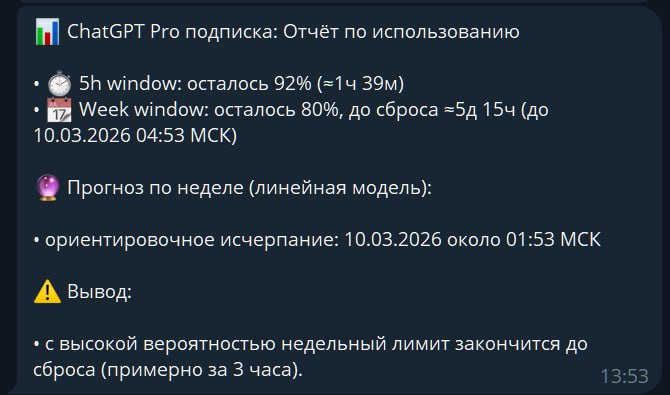

# chip-chatgpt-usage

Script-first OpenClaw skill for ChatGPT Pro usage reporting (5h/Week).

## What changed

Before:
- docs-only skill
- cron prompt asked the model to improvise a report
- source routing drifted into `session_status`, browser attempts, or generic reasoning

Now:
- one updater: `scripts/update_source.py`
- one reporter: `scripts/report.py`
- one explicit source snapshot schema
- fail-closed behavior (`NO_REPLY` if no source snapshot)
- forbidden fallback to `session_status`

## Files

- `SKILL.md`
- `cron-job.example.json`
- `scripts/report.py`
- `state/source.schema.example.json`
- `assets/usage-report-example.jpg`

## Contract

The model must not invent the report.
It must run the script and return exact stdout.

## Example

